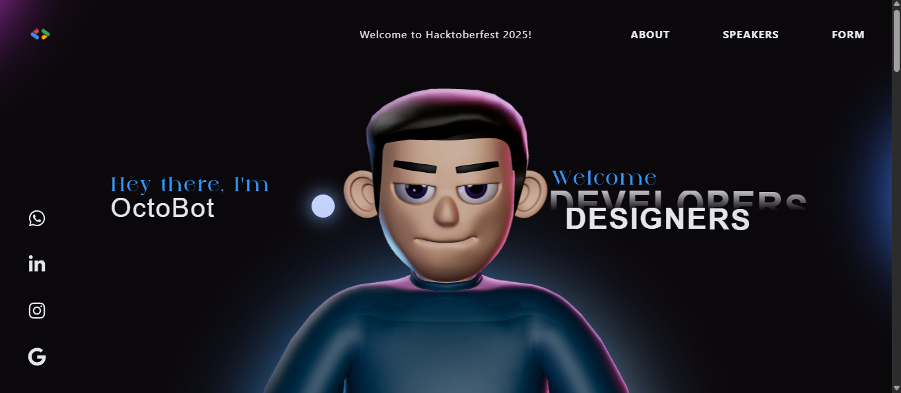

# 🎃 GDG Hacktoberfest Demo Website

Welcome to the **Google Developer Groups (GDG) Hacktoberfest Demo Website**! 🚀 This project is designed to showcase modern web development technologies and serve as an interactive demo for Hacktoberfest participants. Built with cutting-edge technologies including React, TypeScript, Three.js, and GSAP animations.



---

## 🌐 Live Demo

🔗 [GDG Hacktoberfest Demo](https://hacktoberfest-gdg.vercel.app/) 

---

## 🚀 Features

- ⚛️ Built with **React**, **TypeScript**, **Vite**
- � Styled using **Tailwind CSS** for responsive, mobile-first design
- ✨ **GSAP animations** with smooth scroll triggers and timelines
- 🌐 Interactive **3D character** using **Three.js** and WebGL
- 🎃 **Hacktoberfest-themed** countdown timer and event registration
- 👥 **Speaker showcase** with interactive card grid
- � **Google Sheets integration** for event registration forms
- 📱 Fully responsive across all screen sizes
- 🎯 Perfect for **open-source contribution** and learning

---

## 📦 Tech Stack

- **Framework:** React 18, Vite ⚡
- **Languages:** TypeScript, HTML5, CSS3 💻
- **Styling:** Tailwind CSS 🎨
- **Animation:** GSAP, Three.js 🎬
- **3D Graphics:** Three.js, WebGL 🌐
- **Forms:** Google Sheets API integration 📊
- **Package Manager:** pnpm (recommended) 📦
- **Hosting:** Vercel 🚀

---

## 🛠️ Installation & Setup

> ⚠️ **Important:** This project uses **GSAP trial plugins** which **cannot be used in production hosting**.  
> � For production deployment, get official **GSAP Club plugins**: [GSAP Club](https://gsap.com/docs/v3/Installation/)

### � Prerequisites

- **Node.js** (v18 or higher) 🟢
- **pnpm** (recommended package manager) 📦

### 🚀 Quick Start

```bash
# 📥 Clone the repository
git clone https://github.com/your-username/gdg-hacktoberfest-demo.git
cd gdg-hacktoberfest-demo

# 📦 Install dependencies using pnpm
pnpm install

# 🔧 Environment Setup
# Copy the example environment file
cp .env.example .env

# ✏️ Edit the .env file with your configuration
# Add your Google Sheets URL and other environment variables
```

### 🔐 Environment Configuration

1. **Rename the environment file:**
   ```bash
   mv .env.example .env
   ```

2. **Configure your environment variables in `.env`:**
   ```env
   VITE_GOOGLE_SHEETS_URL=your_google_sheets_webhook_url_here
   # Add other environment variables as needed
   ```

### 📊 Google Sheets Setup

For setting up Google Sheets integration for form submissions:

📖 **Please refer to `GoogleFormSetup.md`** for detailed instructions on:
- Creating a Google Sheet for form data
- Setting up Google Apps Script
- Configuring webhook URLs
- Testing form submissions

### 🔄 Development

```bash
# 🚀 Start the development server
pnpm dev

# 🏗️ Build for production
pnpm build

# 👀 Preview production build
pnpm preview

# 🧹 Lint the code
pnpm lint
```

### 📱 Development Server

Your app will be available at:
- **Local:** `http://localhost:5173` 🏠
- **Network:** `http://[your-ip]:5173` 🌐

---

## 🎯 Project Structure

```
📁 gdg-hacktoberfest-demo/
├── 📁 public/               # Static assets
├── 📁 src/
│   ├── 📁 components/       # React components
│   │   ├── 📁 Character/    # 3D character logic
│   │   ├── 📁 styles/       # Component styles
│   │   └── 📁 utils/        # Utility functions
│   ├── 📁 context/          # React context providers
│   ├── 📁 data/             # Static data files
│   └── 📄 main.tsx          # App entry point
├── 📄 .env.example          # Environment variables template
├── 📄 GoogleFormSetup.md    # Google Sheets setup guide
└── 📄 package.json          # Dependencies and scripts
```

---

## � Troubleshooting

### Common Issues

**📦 Package Manager Issues:**
```bash
# If you encounter issues, try clearing cache
pnpm store prune
pnpm install
```

**🌐 3D Model Loading Issues:**
- Ensure you have a stable internet connection
- Check browser console for WebGL support

**📊 Google Sheets Not Working:**
- Verify your `.env` file configuration
- Check `GoogleFormSetup.md` for setup instructions
- Ensure your Google Apps Script is deployed

---

## 🎉 Hacktoberfest 2025

This project is participating in **Hacktoberfest 2025**! 🎃

- 🏷️ **Label:** `hacktoberfest`
- 🎯 **Difficulty:** Beginner to Intermediate
- 🌟 **Perfect for:** First-time contributors
- 📚 **Learning:** React, TypeScript, Three.js, GSAP

### 🏆 Recognition

Contributors will be:
- 📜 Listed in our contributors section
- 🎖️ Mentioned in release notes
- 🌟 Featured on social media (with permission)

---

## 🙏 Acknowledgments

- 🎃 **Hacktoberfest** for inspiring open-source contributions
- 👥 **Google Developer Groups** for community support
- ⚛️ **React Team** for the amazing framework
- ✨ **GSAP Team** for powerful animations
- 🌐 **Three.js Community** for 3D web experiences

---

**🎉 Happy Coding and Happy Hacktoberfest! 🎃**

*Made with ❤️ by Preet Biswas*
